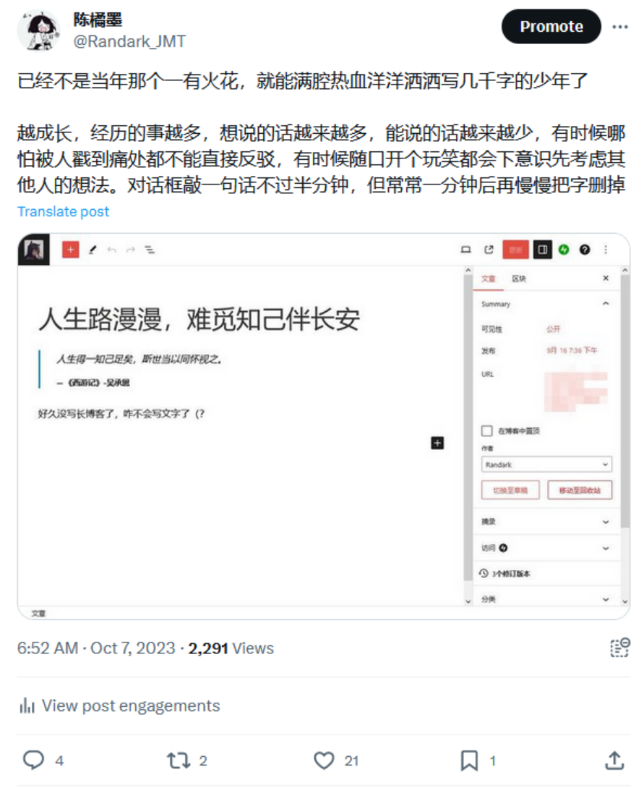

> 人生得一知己足矣，斯世当以同怀视之。
>
> 《西游记》- 吴承恩

好久没有沉下心来，自己一个人慢慢回忆自己的经历和会议，来写一篇文章了。这篇文章可能会偏向意识流，其中可能穿插大量负面情绪，请读者阅读期间注意情绪健康状况 。基于对涉及人员的混淆处理，相关代词和故事细节均已做了混淆处理，请勿代号入座，也请勿随意 yy，橘墨在此十分感谢。也别吐槽这一篇文章的文笔很烂，段落之间没有衔接，毕竟好久没有写过这类的抒情文字了。。。

---

还记得很久以前，可能会在初中那时候，我还是对生活和世界抱有满腔热血的，每天都会有新的想法涌现出来，每一天都会有对未来的美好幻想，每一天仿佛有写不完的灵感，每一天都有做不完的梦。但是中考，进入高中，然后高考，进入大学，在这期间我再也没有写过任何一篇文章，我逐渐在生活和压力的冲刷下学会了圆滑，学会了如何看在当下。未来是残酷的，原来未来没有那么多美好的选择，飘渺的幻想在现实面前都是一团泡沫，原来人最终都是要面对成长的。回看我之前所写的文章，我在其中看到了对未来充满憧憬的自己，看到了具有无限可能的橘墨，看到了一个朝气蓬勃的少年。但是现在的我，刚刚进入大三的我，我无颜面对曾经对我，我对不起我曾经拥有的激情，我失去了曾经的干劲，我将那些文章藏进心底，将这个站重新来过，作为我堆放情绪的收纳桶。

> 东风吹醒恋爱脑，生活磨平英雄梦
>
> Bilibili - shiyuxia

人生路漫漫，如同一场马拉松，我见过形形色色的路人，发生了许许多多的故事。这段故事的的起点，要追溯到，2023-07-09 这一天，我发了这么一条推文：

这篇推文的发送时间，正值暑假期间，那段时间算是我最为迷茫的时候，要去为自己人生第一次护网做面试准备，要在考研 / 直接工作之间做选择，要开始给未来的人生开始做规划。。。那段时间，越努力越觉得自己没有未来，越学习越觉得自己的愚笨，基本上可以说处在一个悲观的死循环里面出不来了，当时反而唯一想的是，要是有一个人能陪陪我就好了，这一条路走下来，一个人可以走下来，但是太无助了。仿佛一个流浪者，失足掉下了河流，在水中扑腾，找不到可以上岸的机会。我仿佛一个跌落井底，在水里扑腾，望着井口的一丝光明，想要爬出来但是无能为力的废物。

在我迷茫的这段时间，有一颗浮木出现在我的人生中，当初相遇的时候，我们还是两个世界的人，相遇的时候也没有轰轰烈烈，只是两个陌生人的简单扩列，故事的开头，不过白开水一样平淡，平淡的仿佛我们不会有下文，是我没有想到，在未来我会动了感情。或许，我们俩就不是一个赛道的人，我们可能会从未相遇，也可能不会有如今的故事。有时候会想，这一切会不会应该从未发生过，会不会两个人从未相遇；或者这段故事没发展到今天，对我是不是一个更好的未来。

曾经我很好奇我的 INFJ 人格是怎么形成的，我回想过我的成长历程，从小我就不是一个擅长主动发展社交的人，也并不擅长与别人发展一段感情 (无论是友情还是爱情)。高中的时候，曾有过一个女生出现在我的心里，出现在我的特别关注里面，那是在我的高中时光中难得的几个快乐时光，但是那是一段没有开头，也没有句号的感情。可能这也直接导致了我现在趋向于独来独往，深度社交几乎为 0 的现状吧。这也正好导致了我之前评价我的那句话：

> 谁要是主动找我交朋友的话，搞不好我会乱发情的
>
> By 迷茫时期的 Randark

我也曾好奇，这段一厢情愿感情，究竟对我是好是坏。这颗浮木，我也加进过特别关注，我也点过 watch，我像是一只下水道的鼠鼠，在我黑暗肮脏的下水道里面，窥视过他 / 她的点点滴滴，但是终究怯于表达出来自己的感情。从一开始，我的理性就告诉过我自己：于情于理，这份感情是肯定没有未来的，所有的一切都可能只是我的一厢情愿，但是就像飞蛾从未意识到那份光明究竟是 LED 还是火苗，我还是毅然做了飞蛾扑火，现在冷静下来想想，还是太感性了一点，可能真的孤独太久了。。。

> 愿许秋风知我意，散我心中意难平
>
> Bilibili - shiyuxia

故事的发展，就省略了吧，在对面的视角，和路人的视角看来，可能两个人之间的故事，就真的只是路人的萍水相逢，亦或者只是一段友情罢了。

可能这就是所谓的溺水者心理吧，在水中，任何一个浮木都可以是挣扎的希望，但是最终能在水面上存活，终究还是靠自己的努力，浮木终究只是浮木，它并不能直接救你于水火之中，他只是给了你一个喘气的机会，让你能够有一段时间可以恢复力量，思考出路，但是抱着这颗浮木终究只能随波漂流，漂向没有定数的未来。能说什么呢，这段感情，终究只是我一个人的一厢情愿，只是一个溺水者的扑腾自救罢了。那个人未来会遇到属于他 / 她对的人，会有一段美好的爱情，会找到对的人，而我，可能只能作为人生的过客，在那个人的人生中，曾经华丽出演过朋友的角色，并最后找一个合适的时间，默默离场。我俩之间又能持续这份感情多久呢，我们都有各自的生活，也有各自活跃的社交圈，有着截然不同的人生态度与理想，可能终究，这份感情的萌芽，就应该被当初的我直接喷一瓶除草剂吧。

路漫漫其修远兮，从来没有一个人敢打包票说，能陪另外一个人从头走到尾把这条路走完。可能属于我的那一个对的人，还在遥远的未来，或者，从来就没有那一位属于我的对的那个人。人生是一场马拉松，最美好的结局，可能就是一个人默默跑到终点，迎接属于自己的终点。

可能对我来说，真的如那些 MBTI 人格分析文章所说，对待所有人都热情相迎，戴上面具，仿佛对每一个人都抱有温柔与热情，但是只有在面具之下的自我，才能明白戴着面具的痛苦。作为 INFJ ，作为橘墨，总会不自觉抱有一份责任感与热心肠，渴望去照顾别人，去揣摩他人的思维和情绪，针对性的给予他人帮助，在给他人提供感情的同时，渴望得到他人的正向反馈，希望有人能够透过面具发现真实的我，去拯救我，去面对面具下弱小，寂寞的我，但终究只是想想就好的事。

我缺朋友吗，我个人认为我是不缺朋友的，但是能做到扒下我面具的那个人，可能在未来等着我吧。朋友终究还是朋友，朋友可以相互扶持，可以互相帮助，但是我没有办法对朋友彻底敞开心扉，没有办法在朋友面前做到毫无顾忌，总是会下意识的斟酌应该给朋友展示什么模样的自己，导致其实交朋友对我来说，其实变成活得更累了，但是习惯已经无法改变了。

孤单，寂寞，不是朋友的问题，而是缺少一位知己，缺少一个我可以依赖的人，一个可以扒下我面具的人，一个我无助的时候拥抱的人，一个我可能从未有机会去相遇的人。

最后，用一段歌词来收尾吧

> 最后一刻，其实我还没走，看你背影，越来越远了
>
> 再美的流星，终究会坠落
>
> 期待过，闪烁过，遗憾过，的我
>
> 终于，懂它的深刻
>
> 印子月 - 落空

应该，以后还会不定期整理一下情绪，大概每个月丢一篇文章进来吧，心里憋得太多了，写写文章释放出来也挺好的。

本来作为给自己 21 岁的生日礼物，应该给自己好好活到 21 岁这一伟大壮举写一篇正面的文章，但是为啥最终写成现在这个样子了呢。。。可能对我来说，找一个地方宣泄情绪，比喝别人熬好的鸡汤，效果会更好吧，至少这一篇挺意识流的文章写完，心里好受了很多，可以抬起头，继续一个人自己继续走自己的路了。

> 谨以此文，献给我的 21 岁。
>
> By 距离 21 岁还有一天的橘墨
